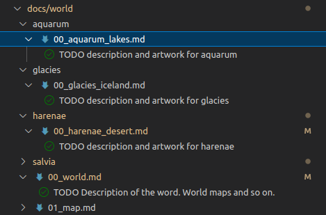

# Chiania

This repository is all about "chiania" the Chia RPG Game from "Chia Inventory".

- [What Chiania is and what the game is about](https://rudolfachter.github.io/chiania/public/)

## You can participate and contribute

- Everything is OpenSource
- Pages are written with [VsCode](https://code.visualstudio.com/) in Markdown
- Website is built with [MkDocs and Material for MkDocs](https://squidfunk.github.io/mkdocs-material/)
- Charts are drawn with [draw.io / diagrams.net](https://app.diagrams.net/)
- Blockchain is [Chia](https://chia.net)
- NFTs are Done by [@mrcic3](https://twitter.com/mrcic3)
    - With [Aseprite](https://www.aseprite.org/)

## How to contribute

- Get [git](https://git-scm.com/downloads)
- Get whatever tools you want (see above)
- Fork this repository [Fork a repo](https://docs.github.com/en/get-started/quickstart/fork-a-repo)
- Clone this repository `git clone https://github.com/YourGithubAccount/chiania.git`
- Make your changes in your fork
- Create a [Pull Request](https://docs.github.com/en/pull-requests/collaborating-with-pull-requests/proposing-changes-to-your-work-with-pull-requests/creating-a-pull-request-from-a-fork) from your fork.
- Then i can review the changes and merge it to the website

## Bookmarks in Markdown

There are `TODO` Bookmarks in markdown. You can search for them or use whatever bookmarking tool you like. In VsCode you can install and use the plugin [ToDo Tree](https://marketplace.visualstudio.com/items?itemName=Gruntfuggly.todo-tree)

