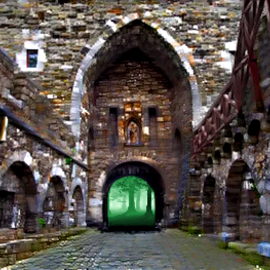

# The Story of Chiania

To edit something -> [click here (GitHub/Rudolf Achter/chiania)](https://github.com/RudolfAchter/chiania/blob/main/docs/02_story.md). Your edit will be reviewed and (when it's good) included.

## The World

{class="story_pic" style="max-width: 100%; width:100%"}

{style="" class="story_pic_left"}

## The recruiting for defence of Chiania Kingdom

Chiania Kingdom is recruiting warriors to against monsters in Black Forest. 

{class="story_pic_right" style=""}

## Slimy monsters creep out of the forest

Evil Slimes are creeping out of the forest. The nature and wildlife is in danger. Nobody knows where they come from. Brave adventurers are needed to face the danger and find out what is going on here.

{class="story_pic_left" style="max-width:100px;float:left"}
There are a lot of brave volunteers. But the poor people of chiania cannot afford much. Most of them came unarmed. They took what they could find. There were stones laying around. The unarmed brave people took the stones, maybe they could be useful.

{class="story_pic_left" style=""}

A guide and kingdom soldier led volunteers into the forest. A slime opens its bloody mouth to welcome intruders.

The unarmed volunteers throwed their stones at the slimes to distract thems while the better armed soldiers took them down.

After a fierce battle, volunteers defeated 3 weak slimes. @MyDearBrain and @petriva72269880, successfully catched 2 and 1 slimes, respectively. A total of 10 volunteers were sacrificed.

{class="story_pic_right" style=""}
A few volunteers canned the weakened slimes into jars. Maybe some of the magicians can investigate the slime.

{class="story_pic_left" style="max-width:200px"}
Many of the volunteers are seriously injured. To help these volunteers defending themselves, the guide cut down some tree barks to make bark shields for every paralyzed volunteers.

The party escaped from the forest.....

{class="story_pic_right" style=""}
{class="story_pic_left" style="max-width:200px"}
The volunteers saw a first small glimpse of the threat approaching chiania. "We need to arm ourselves", a small group said. Luckily the master blacksmith is in chiania main city right now. They went to the blacksmith and asked him if he can make some weapons. "Of course" the blacksmith said "when you pay me the right price". "i'll take only chianian green coins. Of course. The blacksmith shall be payed for his work. The better situated adventurers brought their coins and bought what they could afford. Thime is short, the blacksmith worked a lot of overtime to equip all these brave defenders. After the present volunteers were equipped the blacksmith decided to take a travel to broaden his horizons about smithing. Maybe there will be greater weapons needed agaist the approaching threat.

{class="story_pic_left" style=""}

## The natural balance is broken

Meanwhile the chianian volunteers which canned some slime visited the wise magician in the central castle and gave him a probe of the slime to investigate. He made some tests in his alchemy laboratory but could not find anything. He said "go to the master druid. He lives in a hut in the western woods. Maybe he can help you". So the volunteers followed his advice and went to the master druid. The master druid investigated the slime the volunteers brought to him. He seemed worrie about what he saw.

"The natural balance is broken" he said, "this has no natural source". To save the ecosystem, we need to recruit more volunteers to supress slime population. **The slime monsters have nucleis as their heart**. They bring them to life. "If you can get any of them, **bring them to me**!" The master druid said "i will reward you for them". The volunteers went out in all directions of chiania and brought the disturbing news from the master druid. After a week the master druid saw nearly one-hundred unarmed volunteers standing at the entrance of the forest, then he lost in thought. "What can he do to help these 'brave weaklings' ?

{class="story_pic_right" style=""}
The master druid holds aloft his wand, pure energy are emitted and hitted the ground. Tree roots abnormally grow and show up on the ground. These roots are surrounding by green and yellow magic. The druid ask volunteers to cut roots into sections as weapons.
{class="story_pic_left" style="max-width:100px;"}
Also the druid gives each volunteer a mighty artefact of a demigod. A "soulstone" which is connected to the [goddess of Chiania](03_characters.md#goddess-of-chiania). "Bring this to the [magical tavern](https://discord.com/channels/994949585657143296/995483089881026631) in [Viridis , the main city of Chiania](https://discord.com/channels/994949585657143296/995483089881026631). Bind your souls in the [magical tavern](https://discord.com/channels/994949585657143296/995483089881026631). Then if you ever die in your adventures, the [goddess](03_characters.md#goddess-of-chiania) can revive you and you wake up again the next day." the druid said.

The now bigger an better equipped group went deeper in the black forest to reduce the slime population. They encountered a group of forest slimes...

After a fierce battle, volunteers defeated a total of 20 Forest Slimes. Volunteers decided to enter the deep forest to hunt for stronger preys, Aquatic Slimes and Swamp Slimes

{class="story_pic_left"}

## Deers under control of slimes

After the fierce battle in the forest, some alert adventurers spotted strange creatures wandering. On closer inspection, they noticed that slimes took control of some deers. After careful attempts, they managed to tame and take the deers to [the stables of Viridis](world/00_world.md#stables), the main Chianian city.

The deers are slimed and injured. Some adventurers try to find some medicine to threat the deers and bring them to good health again

{class="story_pic_right"}
The volunteers that were able to kill a slime monster investigeted them further and found monster nucleis where their heart should be. Just like the master druid said. they take monster nucleis from corpses of slimes, which could also be a prove of combat for exchanging the rewards from the master druid.

{class="story_pic_left"}
## The master druid was killed!

The brave volunteers who got a monster nucleis went to the hut in the western woods where the master druid lives. They kocked at the door, nobody answered. They begun to search him. A few meters deeper in the woods they only found his corpse. The head of master druid was cut off and was threw five meter away from his body. "How master druid, a hemigod in Chiania, was killed?" More importantly, where's the reward of quest?

{class="story_pic_right"}
A jeweler passed by the Blacksmith Shop, he was attracted by the glowing Monster Nucleis hold by volunteers. "If you give me these gems, I use the large ones to make rings or the medium ones to enhance your weapons." Says by the jeweler.

{class="story_pic_left";style="width:600px;"}
## Defense of Viridis

While the wizards of Viridis are investigating the murder of the master druid, the volunteers of the city are defending their homes at the gate of viridis. Together with the City Guards they are patroling at the gate and at the border of the black forest. The most brave and strong adventurers advance even further and push into the deep woods to clean it from dangerous monsters. Meanwhile the most talented craftsmen are making equipment for the volunteers to protect them from danger. Nobody thought at the peaceful land of Salvia that any kind of mercenaries would ever be needed again. But these monsters have to be faced against.

## The Story continues...

To get the latest news in chiania go to certain places:

- [Chiania News](https://discord.com/channels/994949585657143296/995945537603911770)
- [Chiania Events](https://discord.com/channels/994949585657143296/995484176428044378)
- [Quest Announcements](https://discord.com/channels/994949585657143296/995496698086432838)

If you have valuable items to sell:

- Go to the [marketplace](https://discord.com/channels/994949585657143296/997830621831368734) in the kingdom street
- Or look which [markets](items/20_markets.md) are known in the world of chiania