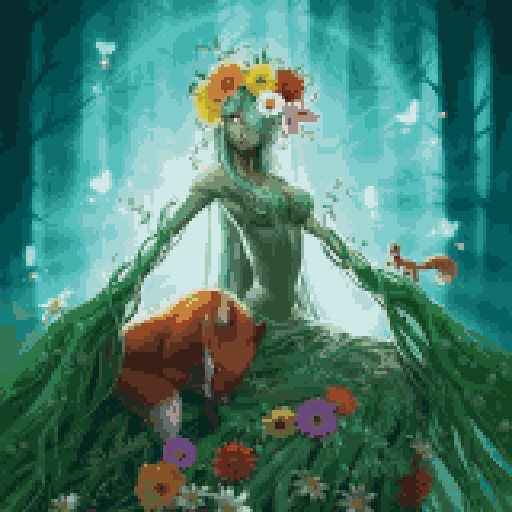

# Characters

{class="story_pic_left" style=""}
## Blacksmith

The Blacksmith lifes at Chiania capital. If he is not travelling you would find him at the forge near the market place. 

{class="story_pic_left" style=""}
## Master Druid

The master druid is a wise demigod living in the western woods. His deep valuable knowledge about the nature and the magical forces holding the world together.

{class="story_pic_left" style="width:400px"}
## Goddess of Chiania

The goddes of Chiania watches over life and nature

{class="story_pic_left" style="width:400px"}
## Mimic

Mimic is a living chest

