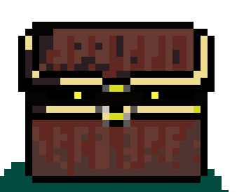
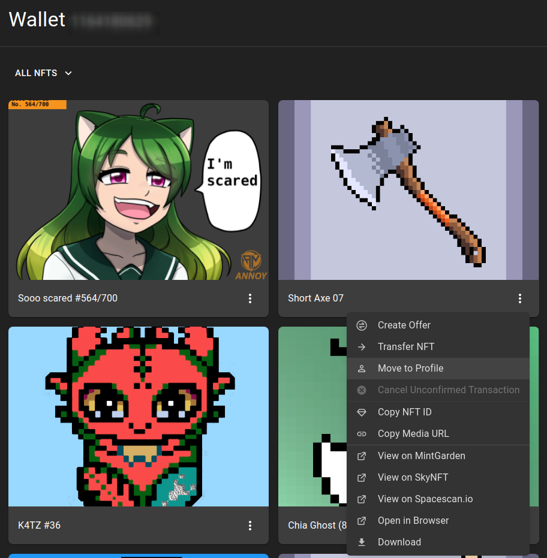
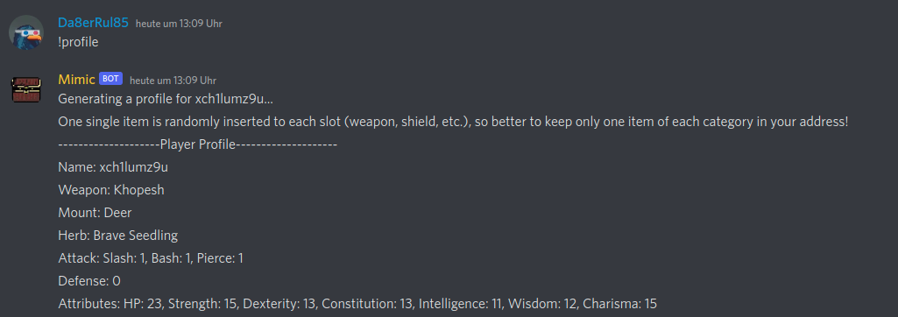
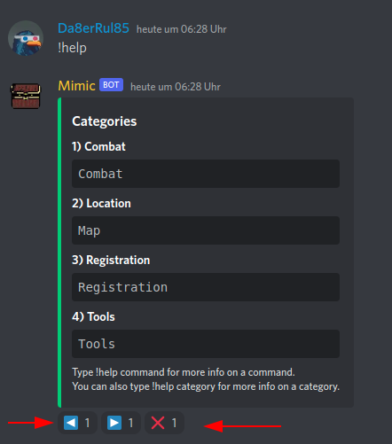

# Chiania - The Chia Inventory RPG Game

## [Introduction](https://discordapp.com/channels/994949585657143296/995478713561001984/995479550848933930)

"Chia Inventory" is a RPG-style NFT collection, with an unique NFT releasing conecpt: all of the NFTs are items generated during our RPG gaming process.
 
[Green Whale](https://twitter.com/mrcic3) Is playing as a storyteller and blacksmith in this endless RPG game. He continuously releases stories, quests, and events. Players who bought our NFT equipment are able to join endless quests and events, and win more NFTs for free.

Players can also sell NFTs to allow newbies to join the game.

So, this is the concept, an endless Role Play Game with NFTs as items for your character and the world. Fun and story are the core values of Chia Inventory.


## Come to Discord

At this time "Chia Inventory - the Chianian Quest" is played in Discord.

- [Join here (Discord Channel - Chia Inventory)](https://discord.gg/pDGJf5f6)


## Register your player

{class="story_pic_right" style="width:200px"}
Mimic is a living chest and the bot who welcomes you to the world of chiania in the Adventurers Guild. Go to the [registration-counter](https://discord.com/channels/994949585657143296/1000344248312397854) and spell the magic word `!register` and mimic will memorize you with your Chia Address. 

### Get an official Chia Light Wallet

The official Chia Wallet is the most safe place for your Chiania Items (NFTs).

The official Chia Client is available for all platforms (except mobile)
- [Chia.net - Download](https://www.chia.net/download/)

When starting Chia the first time you are asked which mode you want. "Light Wallet" or "Full Node". To Play Chiania **Light Wallet** is enough.

- Create your wallet
- Write down your menmonic
- Wait until Wallet is fully synced

### Create a Profile - DID

First you have to create a DID (Distributed Identifier). In Chia Wallet it's called "Profile". - Go to Settings -> Profiles
- Create a new Profile (or better two)
- Name the first Profile "Chiania Equipped"
    - this would be for the items your Character has equipped
- Name the seconds Profile "Chiania Inventory"
    - this would be items you have in reserve


- Go to [registration-counter](https://discord.com/channels/994949585657143296/1000344248312397854) and register with a command like this:

```text
!register did:chia:1abczooEXAMPLEooEXAMPLEoodbca
```


### Manage your Items

When you want to use a item for Chiania you simply move it into the right Profile.



In this example i want to equip "Short Axe"


You can have one item of each category equipped. If there is more than one item of one category in your "equipped" DID, then one item randomly is selected for you.

Item Categories so far:

- Weapon
- Shield
- Ring
- Mount (something you ride on)
- Familar (a pet or so)


## Check your registered Inventory

To check what you character now has equipped use the command `!profile`.
The stats of you character are rerolled at each quest. So your character can have a "goog" or a "bad" day. The Items you have give you a buff. With a little luck even worse equipped characters could be strong when they roll good stats in a quest.



## Get Help

You can enter `!help` as a Chat message to get a list of possible commands. Commands are in Categories

```text
Categories
1) Combat
Combat
2) Location
Map
3) Registration
Registration
4) Tools
Tools
Type !help command for more info on a command.
You can also type !help category for more info on a category.
```

There is "page forward", "page back" and "cancel" under the help menu. You can click them.



So you can use these help Commands

`!help Combat`

`!help Location`

`!help Registration`

`!help Tools`


## Mimic's Bot Functions in Discord (so far)

Mimic understands a few "magic words". You can talk to mimic anytime and make some spells.

### Combat

`!hunt` : Go hunting for monsters on your current location. You hant whatever monsters can be found at your current location. Maybe check your current location first `!look` and your `!profile` before you go hunting. If you die angainst a monster It will last 3 hours until the [Goddess of Chiania](03_characters#goddess-of-chiania) can revive you.

### Location

`!look`: Gives a description of the place around you. Says what you can do here and what direction you can go next.

`!go (north|south|east|west)`: Example `go east`: Move your character. Look at the [World Map](world/01_map.md) for reference

### Registration

`!register`
Example: `!register xch1example1234example4321` : Registers the DID Address you use for playing. Items must be in there. If you change your DID your progress (Experience Points, "virtual" Wallet) is lost. NFTs and CAT2 Coins will stay in your wallet.

`!profile`
Example: `!profile` : Shows your profile the Mimic bot has registered. This includes your character stats and your equipped items. One Item of each category is randomly selected and equipped. So if you want to control this have just only one item of each category in this address. You can register multiple addresses with one chia wallet.


### Tools

`!dice`: Rolls a dice with 20 numbers. No Function until now

## Register for Quests

Go to the [registration-counter in the adventurers guild](https://discord.com/channels/994949585657143296/1000344248312397854). When there is a quest announced in [quest-announcements](https://discord.com/channels/994949585657143296/995496698086432838) you have a few days time to register for it at [registration-counter](https://discord.com/channels/994949585657143296/1000344248312397854)

## Get Equipment for your character

### Look which items you can use for Chiania

- [Item Types](http://0.0.0.0:8082/chiania/public/items/50_types/)

### Ask for Offers on Discord

- [Marketplace Channel](https://discord.com/channels/994949585657143296/997830621831368734)
- [The Tavern](https://discord.com/channels/994949585657143296/995483089881026631)

### Go to the [markets](items/20_markets.md)

At the [markets](items/20_markets.md) you will find equipment for your character. The ["blue duck" at the Main Market Square](https://dexie.space/offers/col16fpva26fhdjp2echs3cr7c30gzl7qe67hu9grtsjcqldz354asjsyzp6wx/xch) is open 24x7. But if you look carefully then you can find goood offer for example by the blacksmith. Go to the [markets](items/20_markets.md) stroll and look.

## Gaming System

It is best to follow the game via the [Chia Inventory Discord Server](https://discord.gg/pDGJf5f6)

### General Game Progress

This is the gaming loop so far:

- [You buy weapons / equipment when it is released (original offers on dexie.space)](https://dexie.space/offers/col16fpva26fhdjp2echs3cr7c30gzl7qe67hu9grtsjcqldz354asjsyzp6wx/xch).
    - [This are the weapon types you can get so far](items/50_types.md)
- [A quest is announced (Discord or Twitter)](https://discordapp.com/channels/994949585657143296/995496698086432838)
- [You register for the quest](https://discordapp.com/channels/994949585657143296/998007766297870416)

{class="full_pic" style="width:500px"}

### Fighting System

Current state is:

#### Quests

- A party of players registers for a quest
- The party goes out for a quest
- The party approaches enemies. These have stats like:
    - General
        - HP Health Points
        - AKT Attack Value
    - Defense against specific Damage
        - Slash
        - Bash
        - Pierce
        - Magic

{class="full_pic" style="width:500px"}

#### Hunting when there are no quests

You can go hunting for Monsters in [the Forest](https://discord.com/channels/994949585657143296/1001435613641318462). Just type command `!hunt`. Then you search for a monster and fight against it. If you win, you get a reward. If you die your soul wanders to the soulstone in the [magical Tavern](https://discord.com/channels/994949585657143296/995483089881026631). There Your soul prays to the [goddess of Chiania](03_characters.md#goddess-of-chiania). You Hope she can revive you. Revival typically lasts 12 hours.

## Speed of Events (Patience)

It's an Infinite RPG Game. So you are not in a hurry. Quests are announced a few days in advance. When events happen (such as fights or rewards) the items are minted in real time on the Chia Blockchain (they don't exist before the event). So it can last a while until you receive your items. There is a [Quest Data Log](https://discordapp.com/channels/994949585657143296/998574861918142546) on the discord server. Here you can see how your character has performed and if there were items dropped for you.

The Story progresses after previous events were processed.