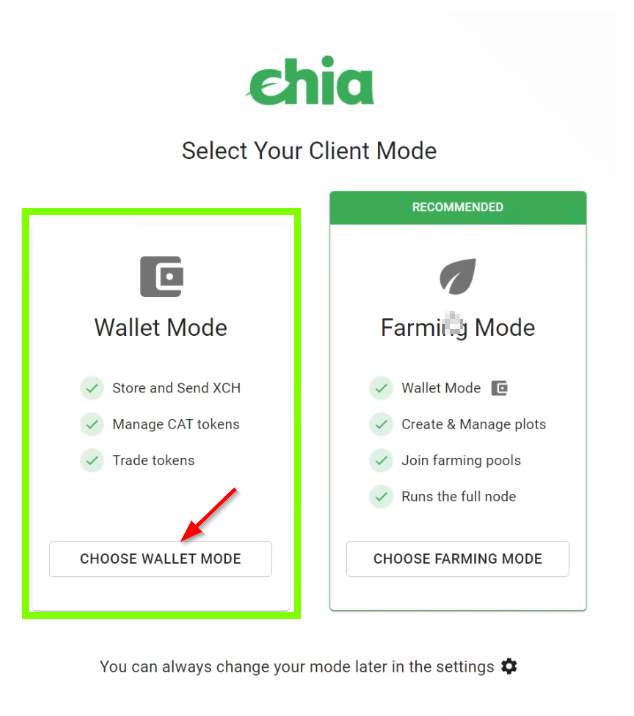
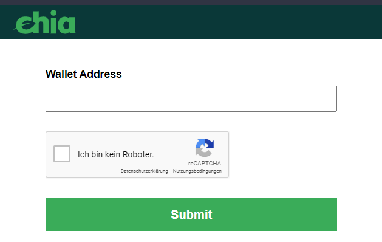
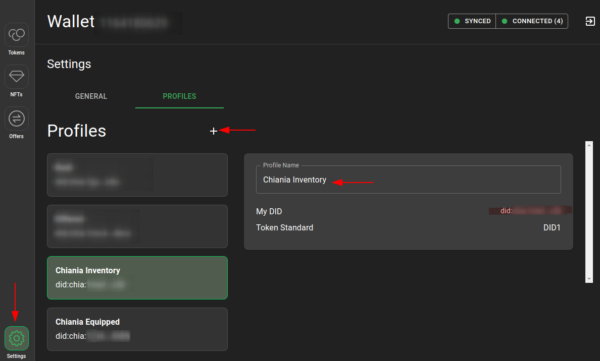
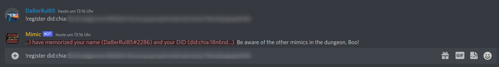

# Chiania - The Chia Inventory RPG Game

## [Introduction](https://discordapp.com/channels/994949585657143296/995478713561001984/995479550848933930)

"Chia Inventory" is a RPG-style NFT collection, with an unique NFT releasing conecpt: all of the NFTs are items generated during our RPG gaming process.
 
[Green Whale](https://twitter.com/mrcic3) Is playing as a storyteller and blacksmith in this endless RPG game. He continuously releases stories, quests, and events. Players who bought our NFT equipment are able to join endless quests and events, and win more NFTs for free.

Players can also sell NFTs to allow newbies to join the game.

So, this is the concept, an endless Role Play Game with NFTs as items for your character and the world. Fun and story are the core values of Chia Inventory.

## Getting started

### Get an official Chia Light Wallet

The official Chia Wallet is the most safe place for your Chiania Items (NFTs).

The official Chia Client is available for all platforms (except mobile)
- [Chia.net - Download](https://www.chia.net/download/)

When starting Chia the first time you are asked which mode you want. "Light Wallet" or "Full Node". To Play Chiania **Light Wallet** is enough.



- Create your wallet
- Write down your menmonic
- Wait until Wallet is fully synced
- While waiting you can [join our Discord Channel](https://discord.gg/8JmQ9Wu5aF)

### Create a Profile - DID

First you have to create a DID (Distributed Identifier). In Chia Wallet it's called "Profile". This is where you save the NFTs you use for Chiania. You need at least 1 Mojo (one Trillionth XCH) to create a Profile. If you haven't any Mojo already you can get some from a [Chia Faucet](https://faucet.chia.net/). Enter your Chia Wallet Address to get 10 Mojo



When you have at least 1 Mojo then:

- Go to Settings -> Profiles
- Create a new Profile **you need only one profile**. I recommend the second profile if you have many items. I use one DID to Equip items. The other DID has NFTs in reserve (that i dont have equipped or i want to trade with.)
- Name the first Profile "Chiania Equipped"
    - this would be for the items your Character has equipped
- **Optional:** Name the seconds Profile "Chiania Inventory"
    - this would be items you have in reserve
- **Give it some time to settle on the Blockchain**. It can last some time until your DID is settled on the Blockchain. So if you get an error message while registering that your did does not exist you may have to wait ()




### Come to Discord

"Chia Inventory - the Chianian Quest" is played in Discord. Join our Discord Channel if you haven't already.

- [Join here (Discord Channel - Chia Inventory)](https://discord.gg/8JmQ9Wu5aF)

 **Attention**. Some actions require to **receive Direct Messages from Bots on this server**. Check your privacy Settings to receive Direct Messages from our Discord Server or at least allow Direct Messages from the bots there.

## Register your player to connect your Chia DID / Profile to your Discord ID

{class="story_pic_right" style="width:200px"}
Mimic is a living chest and the bot who welcomes you to the world of chiania in the Adventurers Guild. Go to the [registration-counter](https://discord.com/channels/994949585657143296/1000344248312397854) and spell the magic word `!register` and mimic will memorize you with your Chia Address. 

- Go to [registration-counter](https://discord.com/channels/994949585657143296/1000344248312397854) and register with a command like this:

```text
!register did:chia:1abczooEXAMPLEooEXAMPLEoodbca
```



## Read On

- [Equip your Character](how_to/10_equip_your_char.md)
- [Play Chiania Game (or how to interact with the world)](how_to/20_play_game.md)