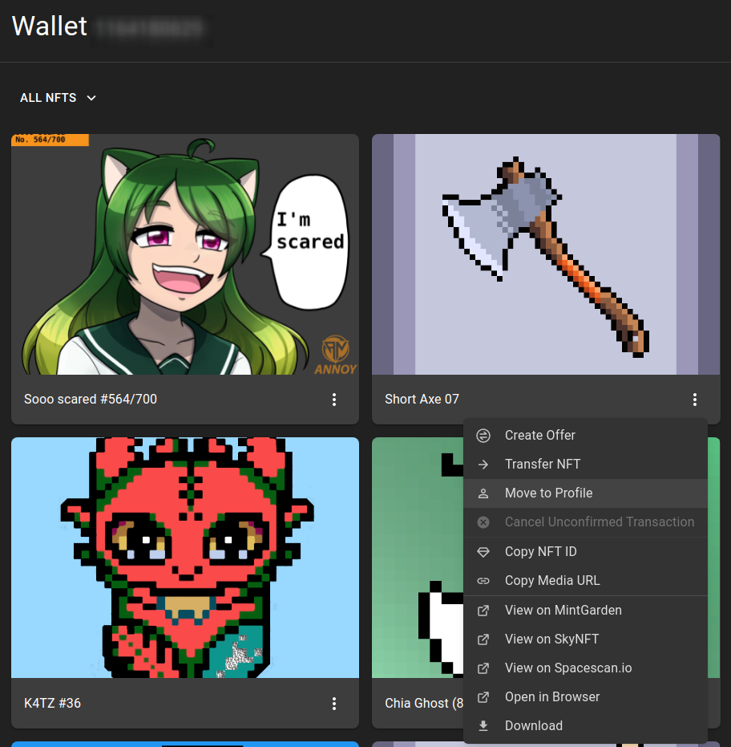
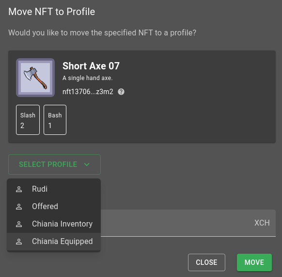
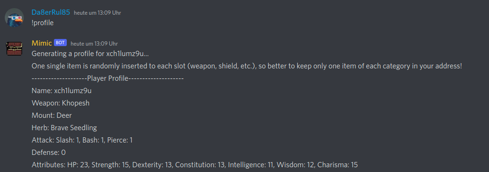

# Get Equipment for your character

## Look which items you can use for Chiania

- [Item Types](../items/Types/README.md)

## Ask for Offers on Discord

- [Marketplace Channel](https://discord.com/channels/994949585657143296/997830621831368734)
- [The Tavern](https://discord.com/channels/994949585657143296/995483089881026631)

## Go to the [markets](../items/20_markets.md)

At the [markets](../items/20_markets.md) you will find equipment for your character. The ["blue duck" at the Main Market Square](https://dexie.space/offers/col16fpva26fhdjp2echs3cr7c30gzl7qe67hu9grtsjcqldz354asjsyzp6wx/xch) is open 24x7. But if you look carefully then you can find goood offer for example by the blacksmith. Go to the [markets](../items/20_markets.md) stroll and look.

## Buy Items Ingame

You can also buy Items ingame. Look at [Merchant](20_play_game.md#merchant)

## Manage your Items

When you want to use a item for Chiania you simply move it into the right Profile.

In this example i want to equip "Short Axe"

You can have one item of each category equipped. If there is more than one item of one category in your "equipped" DID, then one item randomly is selected for you.

Item Categories so far:

- Weapon
- Shield
- Ring
- Mount (something you ride on)
- Familar (a pet or so)

## Check your registered Inventory

To check what you character now has equipped use the command `!profile`.
The stats of you character are rerolled at each quest. So your character can have a "goog" or a "bad" day. The Items you have give you a buff. With a little luck even worse equipped characters could be strong when they roll good stats in a quest.

