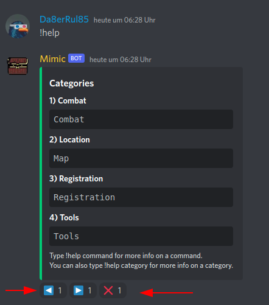
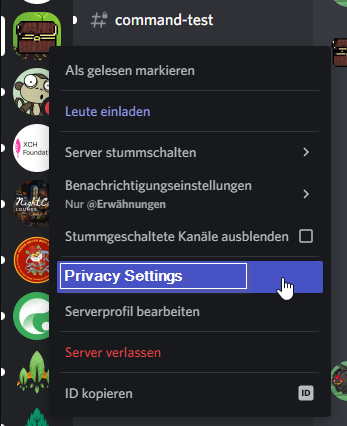
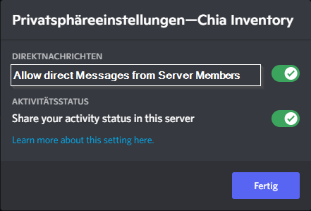

# Play Chiania

Chiania is played on our [Discord Server](https://discord.gg/8JmQ9Wu5aF)

## Check what you can do - Get Help

You can enter `!help` as a Chat message to get a list of possible commands. Commands are in Categories

```text
Categories
1) Combat
Combat
2) Developer
Developer tools
3) Dictionary
Dictionary
4) Interaction
Interact with NPCs
5) Location
Map
6) Merchant
Merchant
7) Registration
Registration
8) Tools
Tools
9) World_magic
World_magic
Type !help command for more info on a command.

You can also type !help category for more info on a category.
```

There is "page forward", "page back" and "cancel" under the help menu. You can click them.



So you can use these help Commands:

`!help Combat`

`!help Location`

`!help Merchant`

`!help Registration`

`!help Tools`

`!help Interaction`

`!help World_magic`


## Mimic's Bot Functions in Discord (so far)

Mimic understands a few "magic words". You can talk to mimic anytime and make some spells.

### Combat

#### !hunt

`!hunt` : Go hunting for monsters on your current location. You hant whatever monsters can be found at your current location. Maybe check your current location first `!look` and your `!profile` before you go hunting. If you die angainst a monster It will last 3 hours until the [Goddess of Chiania](03_characters#goddess-of-chiania) can revive you.

#### !attack

`!attack` : You can directly target a specific monster with `!attack Monster Name`. You can examine which monsters are here by using `!look`. Monsters spawn from time to time and can move between some locations.

#### !set_channel

`!set_channel` : Fighting and Hunting creates a lot of text in the text channels. But doing hunting in Direct Messages woudn't be so much fun. So we decided to have multiple "hunting grounds" were player can come together and go hunting. Choose one of the hunting Grounds in Discord. For example [hunting-ground-4](https://discord.com/channels/994949585657143296/1006148629150576730) then type `!set_channel`

Mimic answers

```text
You decided to set 🍎hunting-ground-4 as your home.
```

Then all hunting and fighting notifications for you go in this channel.

### Location

#### !look

`!look`: Gives a description of the place around you. Says what you can do here and what direction you can go next.

#### !go

`!go (north|south|east|west)`: Example `go east`: Move your character. Look at the [World Map](../world/salvia/00_salvia_main_continent.md) for reference

### Merchant

#### !merchandise

With the current version of Ingame Merchants you can get exclusive Offers for 0.03 XCH. This way you can directly use your coins from ingame wallet right now. 

**Attention** when you buy ingame in Discord, the Mimic Bot will send you an offer with a direct Message. You have to be able to receive Direct Messages from Mimic Bot. So check your privacy Settings for this. Maybe enable Direct Messages for Chia Inventory Server.





- You Enter `!merchandise` in Discord.
- Mimic answers with a table of items you can buy right now with Chiania Coin Prices

This is subject to change. When it is implemented you have to go to the specific NPC first and then talk to him to get offers. For Example you get Weapons at the blacksmith.

#### !buy

- Enter `!buy <serialnumber>` use the serialnumber of the item you want to buy. For example `!buy 1`
- Mimic sends you an offer as direct message
- Download offer and accept it in your Chia Wallet

### Registration

#### !register
`!register`
Example: `!register xch1example1234example4321` : Registers the DID Address you use for playing. Items must be in there. If you change your DID your progress (Experience Points, "virtual" Wallet) is lost. NFTs and CAT2 Coins will stay in your wallet.

#### !profile

`!profile`
Example: `!profile` : Shows your profile the Mimic bot has registered. This includes your character stats and your equipped items. One Item of each category is randomly selected and equipped. So if you want to control this have just only one item of each category in this profile / did. You can register multiple profiles with one chia wallet, but a item can only be in one profile. Before each quests your base stats will be rerolled. So your character can have a "good" or "bad day". Item Attribut bonuses will be calculated on your rolled base stats.


### Tools

#### !dice

`!dice`: Rolls a dice with 20 numbers. No Function until now

#### !set_channel

`!set_channel` : Fighting and Hunting creates a lot of text in the text channels. But doing hunting in Direct Messages woudn't be so much fun. So we decided to have multiple "hunting grounds" were player can come together and go hunting. Choose one of the hunting Grounds in Discord. For example [hunting-ground-4](https://discord.com/channels/994949585657143296/1006148629150576730) then type `!set_channel`

Mimic answers

```text
You decided to set 🍎hunting-ground-4 as your home.
```

### World_magic

#### !tavern

`!tavern` teleports you back to Tavern, in case you got Lost. This takes all your stamina so you have to recover again.


## Register for Quests

Go to the [registration-counter in the adventurers guild](https://discord.com/channels/994949585657143296/1000344248312397854). When there is a quest announced in [quest-announcements](https://discord.com/channels/994949585657143296/995496698086432838) you have a few days time to register for it at [registration-counter](https://discord.com/channels/994949585657143296/1000344248312397854)


## Gaming System

It is best to follow the game via the [Chia Inventory Discord Server](https://discord.gg/8JmQ9Wu5aF)

### General Game Progress

This is the gaming loop so far:

- [You buy weapons / equipment when it is released (original offers on dexie.space)](https://dexie.space/offers/col16fpva26fhdjp2echs3cr7c30gzl7qe67hu9grtsjcqldz354asjsyzp6wx/xch).
    - [This are the weapon types you can get so far](../items/Types/README.md)
- [A quest is announced (Discord or Twitter)](https://discordapp.com/channels/994949585657143296/995496698086432838)
- [You register for the quest](https://discordapp.com/channels/994949585657143296/998007766297870416)

{class="full_pic" style="width:500px"}

### Fighting System

Current state is:

#### Quests

- A party of players registers for a quest
- The party goes out for a quest
- The party approaches enemies. These have stats like:
    - General
        - HP Health Points
        - AKT Attack Value
    - Defense against specific Damage
        - Slash
        - Bash
        - Pierce
        - Magic

{class="full_pic" style="width:500px"}

#### Hunting when there are no quests

You can go hunting for Monsters in [the Forest](https://discord.com/channels/994949585657143296/1001435613641318462). Just type command `!hunt`. Then you search for a monster and fight against it. If you win, you get a reward. If you die your soul wanders to the soulstone in the [magical Tavern](https://discord.com/channels/994949585657143296/995483089881026631). There Your soul prays to the [goddess of Chiania](../03_characters.md#goddess-of-chiania). You Hope she can revive you. Revival typically lasts 12 hours.

## Speed of Events (Patience)

It's an Infinite RPG Game. So you are not in a hurry. Quests are announced a few days in advance. When events happen (such as fights or rewards) the items are minted in real time on the Chia Blockchain (they don't exist before the event). So it can last a while until you receive your items. There is a [Quest Data Log](https://discordapp.com/channels/994949585657143296/998574861918142546) on the discord server. Here you can see how your character has performed and if there were items dropped for you.

The Story progresses after previous events were processed.