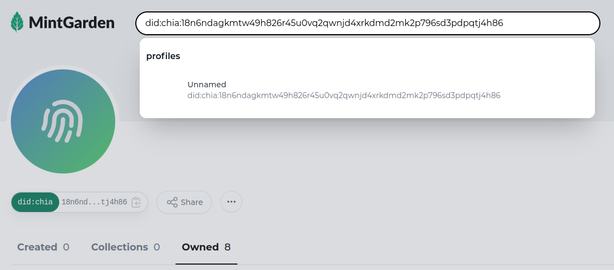
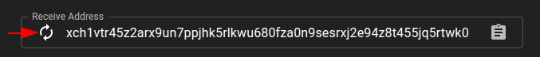
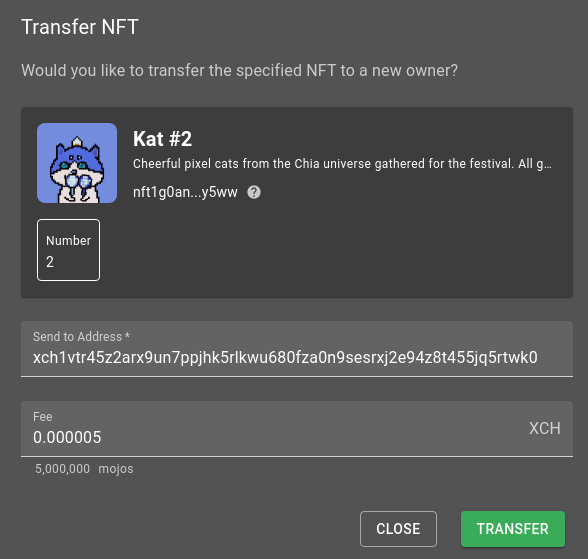
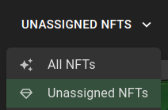
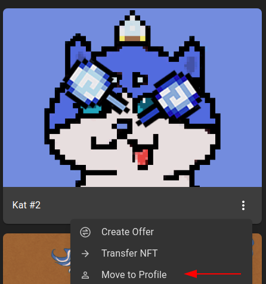
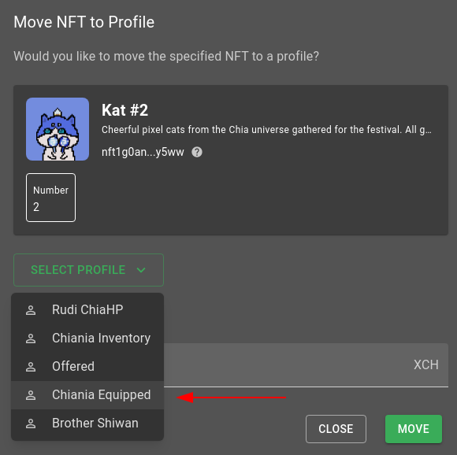

# Troubleshooting

## Items don't show up in Game

Chia Inventory relies on [Mintgarden.io API](https://mintgarden.io) to find your NFTs assigned to your Chia DID. If you find a NFT not assigned to your character, first check your DID on [Mintgarden.io](https://mintgarden.io) 

If your NFT doesn't show under your DID you can try the following.

- Generate a new Receive Address for NFT

- Transfer your NFT to your newly created address

After tranferring your NFT you will see it in "Unassigned NFTs" again. From there:

- Assign NFT to your DID Again

To help Transactions go faster you can always use 0.000005 XCH as Fee (that's 5,000,000 mojos). But fee is not necessary, you just have to wait longer or sometimes try multiple times.

When your item is in the Chia Profile again, you can recheck [Mintgarden.io](https://mintgarden.io) and check `!profile` in Discord again

If Mintgarden does't find any NFTs then there's a bigger Problem on Mitgarden site then you could try reaching out in [Mitgarden Discord](https://discord.gg/8JmQ9Wu5aF)