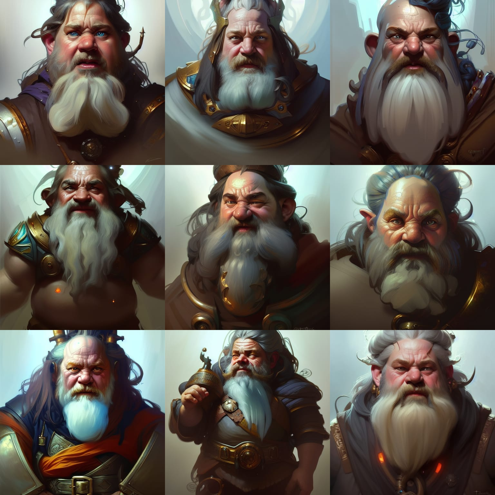
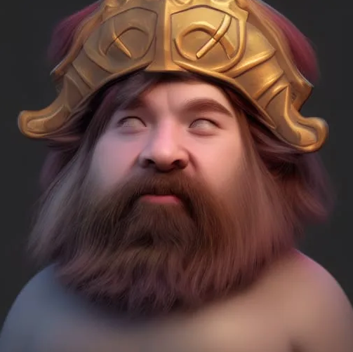
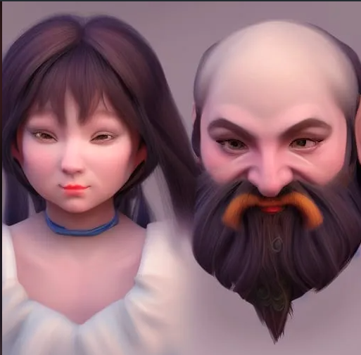
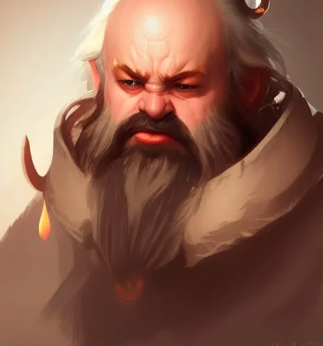
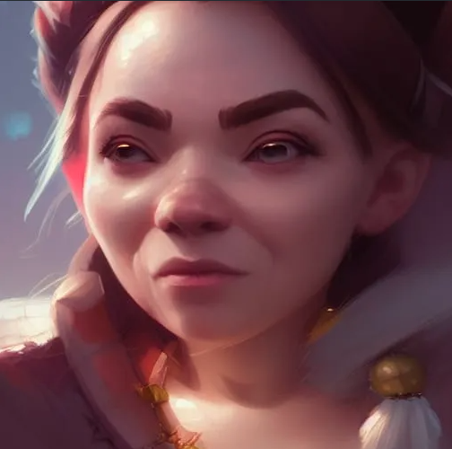
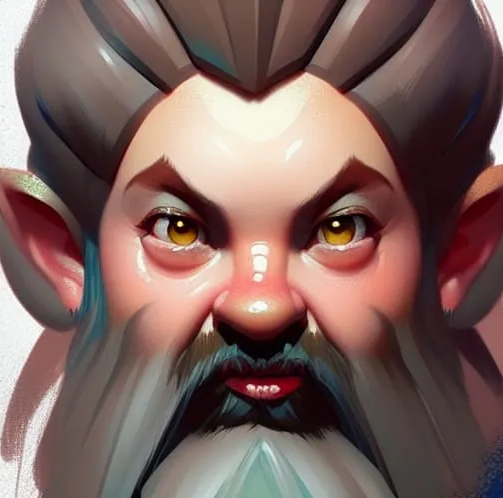
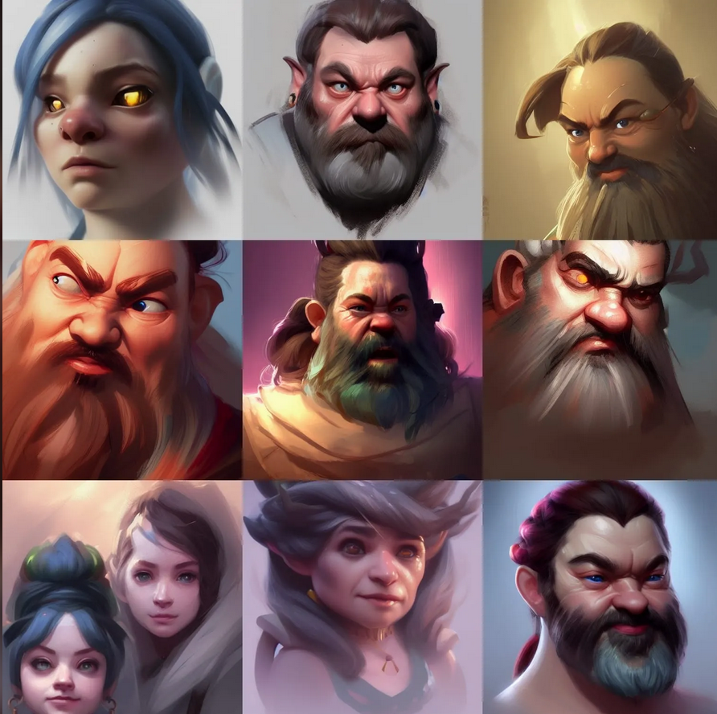

# AI Picture Development

## Profile Pictures

### Dwarf

We start with this example. I think this is a bit too detailed for reducing resolution to pixel Art



| ---                   | ---   |
| --------------------- | ----- |
| Initial Resolution    | Thumb |
| Runtime               | Short |
| Overall Prompt Weight | 90%   |
| Noise Weight          | 70%   |
| Sampling method       | K_LMS |


`portrait of a dwarf fantasy head and shoulders portrait`

** Prompt **

```text

portrait of a dwarf fantasy head and shoulders portrait, 

8k resolution 
concept art 
portrait by Greg Rutkowski, 
Artgerm, WLOP,
Alphonse Mucha 
dynamic lighting hyperdetailed intricately
detailed Splash art 
trending on Artstation 
triadic colors
Unreal Engine 5 volumetric lighting
```

#### Analyzing the parts of the Text Prompt

So basically an AI creating Art can Google and "copy and paste" multiple styles at once fucking fast. Its basically "Big Data for Art"

- [triadic colors](https://en.wikipedia.org/wiki/Color_scheme#Triadic)
- [wlop](https://www.instagram.com/wlop/)
- [Unreal Engine 5 volumetric lighting](https://docs.unrealengine.com/5.0/en-US/volumetric-fog-in-unreal-engine/)
- [artgerm](https://artgerm.com/)
- [trending on Artstation](https://www.artstation.com/?sort_by=trending)
- [art portrait by Greg Rutkowski](https://rutkowski.artstation.com/)
- [Alphonse Mucha](https://www.wikiart.org/en/alphonse-mucha/)

#### So what if i want different style

- More of [sasucchi95](https://www.instagram.com/sasucchi95/)
- And a bit "Sailor Mooon" [Naoko Takeuchi art](https://duckduckgo.com/?q=Naoko+Takeuchi+art&t=brave&ia=web)


```bash
# portrait by Greg Rutkowski, 
# dynamic lighting hyperdetailed intricately
```

```text
portrait of a dwarf fantasy head and shoulders portrait, 
concept art 
triadic colors
Unreal Engine 5 volumetric lighting
sasucchi95
Naoko Takeuchi art
```

Wait what?



```text
portrait of a dwarf fantasy head and shoulders portrait, 
closeup 
concept art 
triadic colors
Unreal Engine 5 volumetric lighting
sasucchi95
Naoko Takeuchi art
trending on Artstation
```

oh man!



OK [Greg Rutkowski](https://www.artstation.com/rutkowski) does a LOT of epic medieval Fantasy Art. So he must definitely be in!
So basically we define from which artists and what tech we steal art from?

```text
portrait of a dwarf fantasy head and shoulders portrait, 
closeup portrait by Greg Rutkowski
concept art 
triadic colors
Unreal Engine 5 volumetric lighting
sasucchi95
Naoko Takeuchi art
trending on Artstation
```

look at that!



so no i want it be more like [Pixel Portraits - aamatniekss](https://www.deviantart.com/aamatniekss/art/Pixel-Portraits-673827709)

```text
portrait of a dwarf fantasy head and shoulders portrait, 
closeup portrait by Greg Rutkowski
concept art 
triadic colors
Unreal Engine 5 volumetric lighting
sasucchi95
Naoko Takeuchi art
trending on Artstation
aamatniekss pixel art deviantart
```

Ok totally not what i expected but nice




```text
portrait of a dwarf fantasy head and shoulders portrait, 
closeup portrait by Greg Rutkowski
concept art 
triadic colors
Unreal Engine 5 volumetric lighting
Naoko Takeuchi art
trending on Artstation
64x64 pixel art
```

OK now this goes a bit abstract. But this style Would be nice to reduce to a lot less pixels...



Lets Try a Grid of 9 Images with the same prompt as above

Wow! i like this

