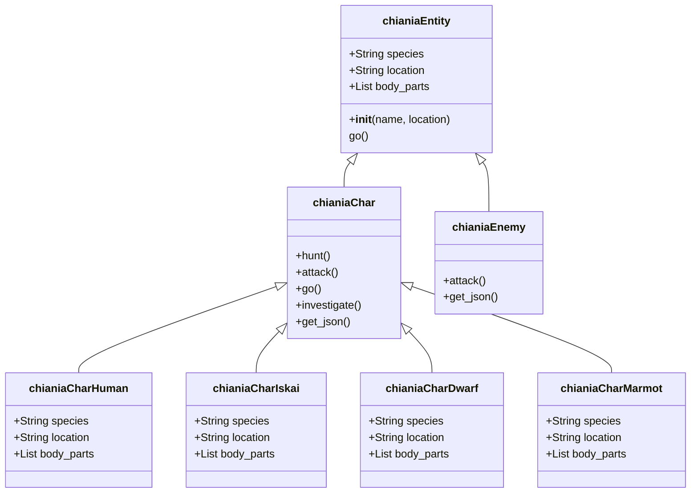

# Character Species System

## Usage of class inheritance

I don't know how classes work now but here some ideas that could make life easier. We want support different species so character types could make great use of Class inheritance in python

