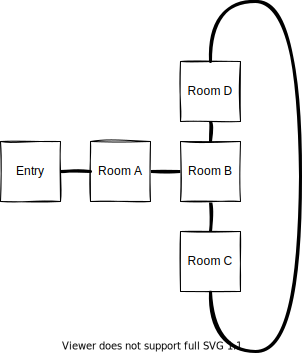

# Mysterious Places in the world

there could be Places doing physically impossible things. "Magical things"

## Randomized Dungeons

There could be randomized dungeons for the player to discover. There could be things like.

- randomized corridors (would be totally possible with current features right now)
- randomized doors to open (no feature impletented for that now)
- randomized little treasures (not implemented yet)
- randomized monsters with theme of the world above. And some cave monsters
- for learing of some python i could try to write a little program for that

### Navigate randomized Dungeons

- Players could get "lost" (don't find the way back)
- There should be no maps for the dungeons, player would have to note his way or draw the map himself

### Help for getting Back

- there is a story item "soulstone" (totally stolen from world of warcraft). Or should we call it **"magical chia root"**?
    - as long as players have stamina for one hunt they could use the item to be teleported back to the last tavern they rested
    - if they have not enough stamina they would have to wait for teleport
    - if they use teleport stamina is drained to zero and starts recovering in the tavern

### How to integrate to the world

- dungeons could be attached somewhere to a place in the world
- dungeoins could be raondomized for
    - every player
      - so every player has its own Experience
    - or from time to time
      - so the community could discover the "new" dungeon and draw maps for it as long as it exists

### Forest of 4 Seasons

- I liked the Woods of 4 Seasons from "Secret of Mana" i believe its called "Seiken Densetsu 2" in Asian World
    - Players had to go through the woolds of 4 seasons in right order. But "seasons" were shuffeled. So you had to figure out which directions to go to bring seasons in right order
- For this the function "teleport me back home" should be already implemented to prevent player frustration :-D

### Magical Maze

I am thinking about a maze where some rooms are connected in a magical way

