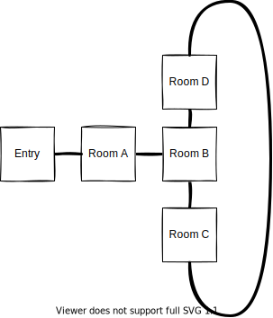

# The World and Moving in the world

## This is what we have so far

- Basic moves are north, south, west, east
- Each "room" can have exits in each direction

## This are new ideas

## Travelling around the world

- there is already the idea of multiple continent
- there could be harbours and ships moving between those harbours
  - when we have chiania coin
  - you could have to pay a fee to the captain to get to another continent
    - a reason to use your chia wallet to go further
    - this should be chiania coin
    - chiania coin should be able to be earned by playing (we already do virtually on discord server)
- there could be gates, bridges or something like that where guards want to be paid toll to let you pass
  - you could have a coice to `!pay`, `!talk` or `!fight`
  - when you `!talk` it could be dependend on you "Charisma" value to persuade the guard to let you pass

## Dungeons could go up and down

If dungeons are in the underground or in buildings we could go "up" and "down". Player gould
- climb a ladder (up and down)
- go up or downstairs
- jump down a hole (one way down)
- use a rope to get down a hole (would need to get a rope first)

There could be even underwater things with:
- caves flooded with water
    - `!swim` (`north`|`south`|`east`|`west`|`up`|`down`)
    - limited air / oxygen
    - there should be caves you can get out of water

## Mysterous Places

there could be Places doing physically impossible things. "Magical things"

### Forest of 4 Seasons

- I liked the Woods of 4 Seasons from "Secret of Mana" i believe its called "Seiken Densetsu 2" in Asian World
    - Players had to go through the woolds of 4 seasons in right order. But "seasons" were shuffeled. So you had to figure out which directions to go to bring seasons in right order
- For this the function "teleport me back home" should be already implemented to prevent player frustration :-D

### Magical Maze

I am thinking about a maze where some rooms are connected in a magical way

