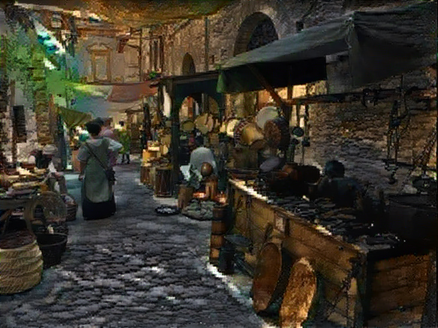
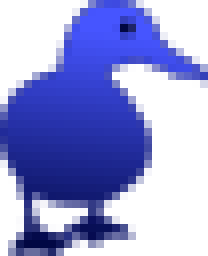

# The Chianian Market
{class="full_pic" style="width:600px;float:left;margin-right:20px;"}
There is a lot of hustle and bustle on the market square. If you are looking for equipment follow the [blue duck](https://dexie.space/offers/col16fpva26fhdjp2echs3cr7c30gzl7qe67hu9grtsjcqldz354asjsyzp6wx/xch)

<a href="https://dexie.space/offers/col16fpva26fhdjp2echs3cr7c30gzl7qe67hu9grtsjcqldz354asjsyzp6wx/xch" target="_blank" markdown="1">
{style="height:128px"}
</a>

You can go to [The garden of NFTs](https://mintgarden.io/collections/chia-inventory-col16fpva26fhdjp2echs3cr7c30gzl7qe67hu9grtsjcqldz354asjsyzp6wx) and to the [magic fortune tellers of space](https://www.spacescan.io/xch/nft/collection/col16fpva26fhdjp2echs3cr7c30gzl7qe67hu9grtsjcqldz354asjsyzp6wx) to see which valuable goods are known to the world.

Also you can [directly meet other brave adventurers and trade with them](https://discord.com/channels/994949585657143296/997830621831368734).