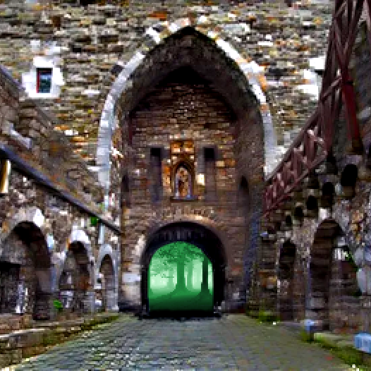
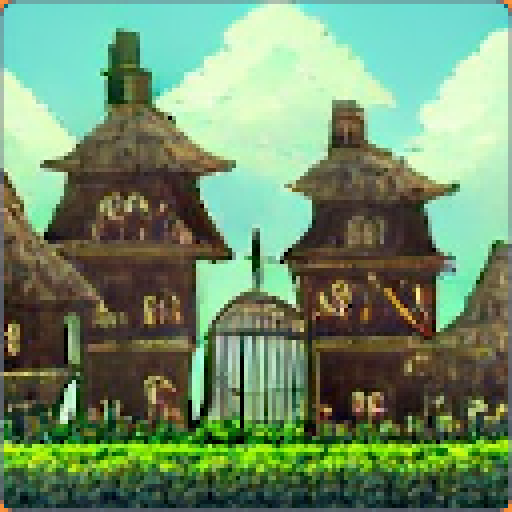
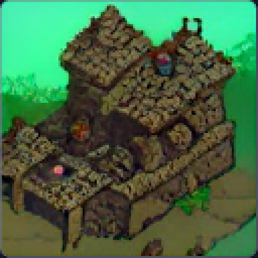

# The search for the druids staff

{class="story_pic_right"}
## The jeweler

A jeweler passed by the Blacksmith Shop, he was attracted by the glowing Monster Nucleis hold by volunteers. "If you give me these gems, I use the large ones to make rings or the medium ones to enhance your weapons." Says by the jeweler.

{class="story_pic_left";style="width:600px;"}

## Defense of Viridis

While the wizards of Viridis are investigating the murder of the master druid, the volunteers of the city are defending their homes at the gate of viridis. Together with the City Guards they are patroling at the gate and at the border of the black forest. The most brave and strong adventurers advance even further and push into the deep woods to clean it from dangerous monsters. Meanwhile the most talented craftsmen are making [equipment](../items/20_markets.md) for the volunteers to protect them from danger. Nobody thought at the peaceful land of Salvia that any kind of mercenaries would ever be needed again. But these monsters have to be faced against.

The master blacksmith has come back and forged many new weapons and armors. This time he decided to sell items by himself, not through black market (Dexie). Adventurers could join our [Discord](https://discord.gg/8JmQ9Wu5aF) and buy these items by `!merchandise` and `!buy`, all cost Chiania Coins (CC). You can earn Coins when you go hunting in the world of chiania. Look in [How to Play](REA../README.mdo get started.

{class="story_pic_wide"}

{class="story_pic_right"}
"Who killed the master druid?" "More importantly, who took the wand of master druid?" This question remains in the mind of blacksmith's greedy apprentice, and he knows a method to track an item with such powerful magic.....

The apprentice of blacksmith has disappeared! "Cloth of the missing apprentice was found in the northern border of slime forest, which is dominated by the goblin stronghold...", a local hunter says.

{class="story_pic_left"}

## The Blacksmith's greedy apprentice

Goblin stronghold is a dangerous place... To save the stupid apprentice, the master blacksmith ask his wisest friend, the oldest old magician, to provide some "magical suggestions". "hum... as I know, there is a spell called `!goblinization`" says by old magician.

"Sounds a good idea to infiltrate the Goblin Stronghold, but how to cast such spell?" asked by the master Blacksmith. "This spell is simple, listen carefully... You need a [magic backpack so save your goods](../README.md) .LIKE-AND-RETWEET-AND-[JOIN-OUR-DISCORD](https://discord.gg/8JmQ9Wu5aF)-AND TYPE `!register your-did-address` THEN say `!goblinization`" says by the magician. A magical vail wraps itself around the adventurers. Now they look exactly like the goblins. "With this disguise we can sneak into the goblin stronghold and rescue the apprentice" one of the adventurers said.

{class="story_pic_right"}
A Trail in the north of the Slime Forest leads to the lands of the goblins. On the way to the stronghold the adventurers came through a gobline Village and a Farm. They notice wodden cages where humans and elfes are locked in. Goblin Warriors and Archers a patroling everywhere.

{class="story_pic_left"}
Thanks to their disguise the Adventurers can sneak into the Goblin Stronhold and can overwhelm the Goblin Guard who has the keys to the cage in the Stronghold. But when they open the cage a few people flee out but they cannot find the apprentice. There is only a note from the apprentice....

## The Story continues...

To get the latest news in chiania go to certain places:

- [Chiania News](https://discord.com/channels/994949585657143296/995945537603911770)
- [Chiania Events](https://discord.com/channels/994949585657143296/995484176428044378)
- [Quest Announcements](https://discord.com/channels/994949585657143296/995496698086432838)

If you want to buy items or have valuable items to sell:

- Go to the [marketplace](https://discord.com/channels/994949585657143296/997830621831368734) in the kingdom street
- Look which [markets](../items/20_markets.md) are known in the world of chiania
- Use the spell `!merchandise` in [Discord](https://discord.com/channels/994949585657143296/997830621831368734) to see what the NPCs have to offer