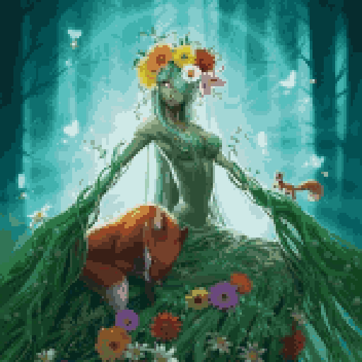

# Characters

{class="story_pic_left" style=""}
## Blacksmith

The Blacksmith is a beardy dwarf lifin at [Chiania capital](../continents/salvia/01_viridis_main_city.md). If he is not travelling you would find him at the forge near the market place. 

## Apprentice of the blacksmith

The Apprentice of the blacksmith is a greedy dwarf always hunting for the newest treasures he might find.

{class="story_pic_left" style=""}
## Master Druid

The master druid is a wise demigod living in the western woods. His deep valuable knowledge about the nature and the magical forces holding the world together. He was killed, and his wand was stolen

{class="story_pic_left" style="width:400px"}
## Goddess of Chiania

The goddess of Chiania watches over life and nature

{class="story_pic_left" style="width:400px"}
## Mimic

Mimic is a living chest. Unlike the other monstrous Mimics in the dungeon, this Mimic is friendly and helps the adventurers.

## The oldest magician

An old wise man living in the magician Tower of [Viridis](../continents/salvia/01_viridis_main_city.md)

## The crazy adept Monster Hunter (with his wagon)

TODO Picture and Description of Monster Hunter [Adept Monster Hunter as described by chiaslimes](https://discord.com/channels/994949585657143296/997830621831368734/1012865868214046921)

## Lena (at marketplace)

TODO Picture and Description of Lena

## Sam (the barkeeper at Tavern)

TODO Picture and Description of Sam