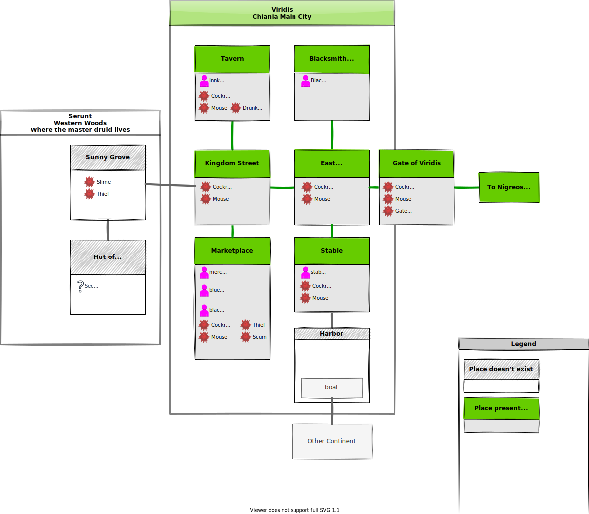
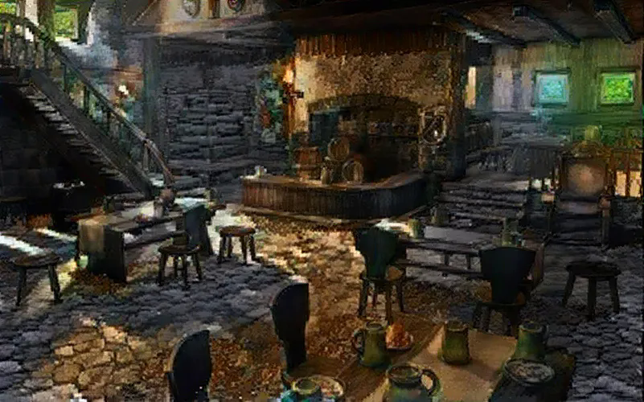
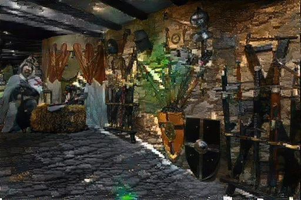
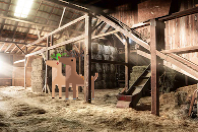

# Viridis (Main City)

## Map of Viridis

## Kingdom Street

### [The Market Place](https://discord.com/channels/994949585657143296/997830621831368734)

{class="story_pic_left" style="max-width:100%;width:500px;"}
There is a lot of hustle and bustle on the [market square](https://discord.com/channels/994949585657143296/997830621831368734). Numerous adventurers offer theier hard-earned wares here. Also there are some professional merchants. Go to the [markets](../../../items/20_markets.md) to see where you can trade your goods.

### [The Tavern](https://discord.com/channels/994949585657143296/995483089881026631)

{class="story_pic_right" style="max-width:100%;width:500px;"}
Volunteers, adventurers and soldiers are meeting in [the 🍺tavern](https://discord.com/channels/994949585657143296/995483089881026631) to organize and talk about adventures they lived through. You can meet many interesting people from allover the kingdom here. There are also people capable of writing magic runes in [the 🍺tavern-中文](https://discord.com/channels/994949585657143296/997649414787182662). Maybe you can hear some rumours about things going on in chiania 

### [The Weapon Rack](https://discord.com/channels/994949585657143296/995497833216102440)

{class="story_pic_left" style="max-width:100%;width:500px"}
Chiania main city normally is a peaceful place. Adventurers and solders are storing their equipment at the [weapon-rack](https://discord.com/channels/994949585657143296/995497833216102440) when they don't need them. They show off their equipment and possibly [trading opportunities](../../../items/20_markets.md) may arise.

## Adventurers Alley

{class="story_pic_right" style="max-width:100%;width:500px"}

### Stables

In the stables you can find some creatures that help you in your adventures. Horse breeding was given up a few years ago. But recently the Stable Master got in some beautiful [Deers](https://dexie.space/offers/col1w0h8kkkh37sfvmhqgd4rac0m0llw4mwl69n53033h94fezjp6jaq4pcd3g/xch). They were saved by the Slimy Monsters in the [Black Forest](02_nigreos_black_forest.md). The animals are strong enough to ride on. [They need a new owner who will take good care of them](https://dexie.space/offers/col1w0h8kkkh37sfvmhqgd4rac0m0llw4mwl69n53033h94fezjp6jaq4pcd3g/xch)

